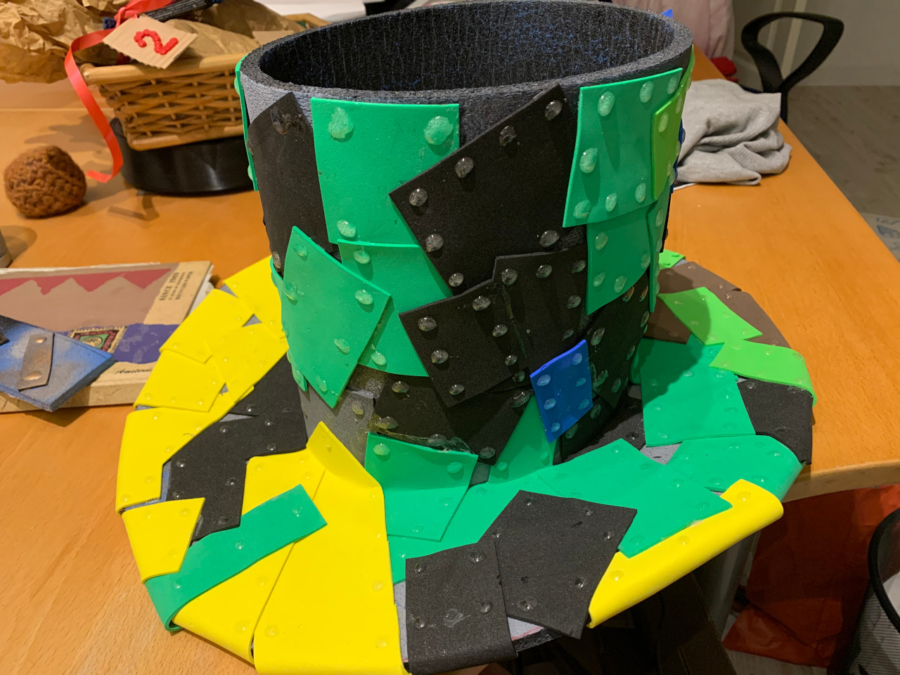
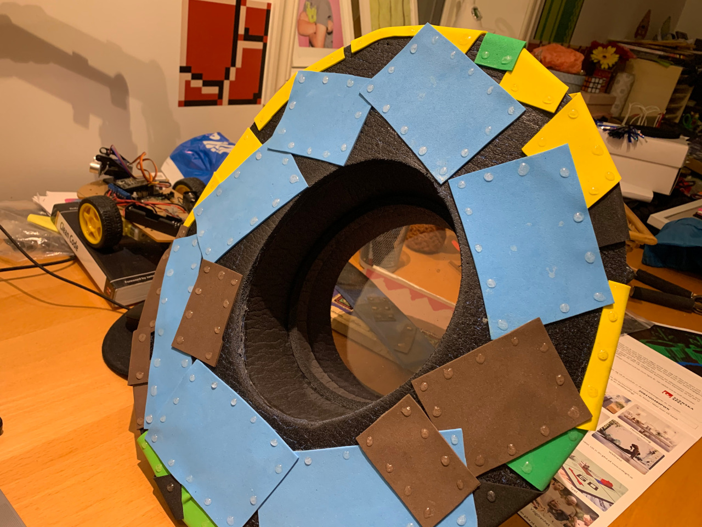
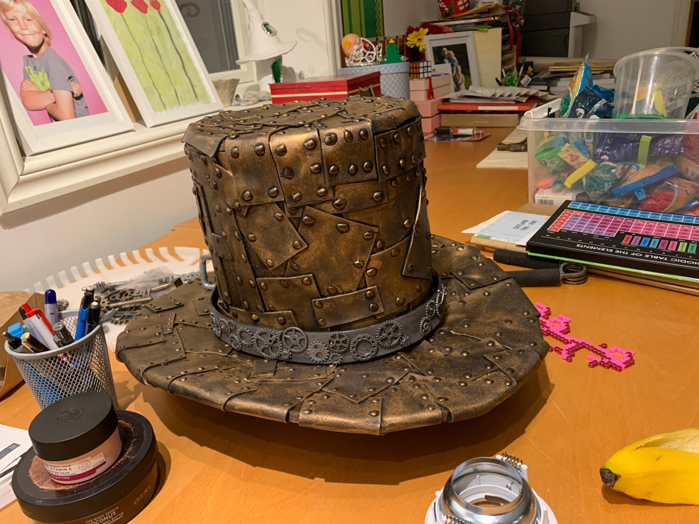

# Top-Hat

En steampunk inspirerad cylinderhatt gjord av "metallplåtar" och inbyggd ångmaskin.

## Inköpslista

<ul>
  <li><a href="https://kristinasscrapbooking.se/dekorationer-diy/dekorgummi-mossgummi/mossgummi-ark/">"Mossgummi" till "plåtar"</a></li>
  <li><a href="https://www.hornbach.se/shop/Loctite-Super-Epoxy-lim-dubbelspruta-25-ml/5130541/artikel-detaljer.html">Epoxy och härdare i samma spruta</a>
  <li>Liggunderlag i cellplast. Finns i de flesta friluftslivs butiker, ta en slät variant som inte är för tunn</li>
  <li>Svart sprayfärg, Biltema m.fl.</li>
  <li>1-2st tuber kontaktlim, Biltema m.fl.</li>
  <li><a href="https://www.google.com/search?q=Aged+brass+Art+alchemy+metallic+wax&tbm=isch">Mässingfärgat metallvax</a></li>
  <li><a href="https://www.aliexpress.com/item/4001275225466.html">"Metal Engine Idling Smoke Generator for Heng Long 1/16 RC Tank Model Car 63HE"</a></li>
  <li><a href="https://www.google.com/search?q=%22lolin+d1+mini%22&tbm=isch">"Lolin D1 Mini"</a>, ESP8266-baserad mikrocontroller</li>
  <li>Egenbyggt kretskort med komponenter, se nedanför.
  </li><a href="https://www.thingiverse.com/thing:2792893">3D printade skorstenar</a>, egna gjorda av koppar funkar också.</li>
</ul>

## Byggbeskrivning

<ol>
  <li>Mät omkretsen på ditt huvud med ett måttband, lägg till 2 cm för lite marginal.</li>
  <li>Skär cylindern till hatten enligt nyss mätta mått utifrån liggunderlaget. Välj själv hur hög den skall vara, min är cirka 18cm.</li>
  <li>Limma ihop ändarna på det utskurna liggunderlaget med kontaktlim, för att forma en cylinder. Låt torka!</li>
  <li>Sätt på cylindern på ditt huvud, ta av den igen och försök bibehåll dess form med hjälp av händerna på sidorna. Placera den formade cylindern på resterande liggunderlag och rita av insidan på cylindern på liggunderlaget. Den ellipse som du nu har ritat på underlaget skall skäras ut med en skalpell.</li>
  <li>Ta en linjal och mät ut cirka 10 cm från insidan av hålet som du nyss skar ut från liggunderlaget och rita ett streck, fortsätt hela vägen runt hålet. Skär längs den nya linjen du just har skapat. Grattis, du har nu skurit till brättet till hatten, limma fast cylindern på brättet med kontaktlim, se till att det blir kant till kant. Låt torka!</li>
  <li>Klipp till olikformade fyrkanter av mossplasten och limma på bitarna på hatten med kontaktlim, gärna delvis på varandra och i lite olika vinklar. Se till att täcka hela cylindern och brättet</li>
  <li>Tryck ut en sträng epoxy på ett papper, ta en tändsticka och rör runt för att blanda epoxi med härdare. Doppa tändstickan i epoxy och försök skapa små limdroppar längs kanterna på varje bit mossplast, dessa skall föreställa nitar i plåtarna. Låt torka!</li>
  <li>Spraya allt svart. Låt torka!</li>
  <li>Ta lite mässnings vax på fingret och gnugga in hela hatten med hjälp av små cirkelrörelser av finget. Detta är det magiska momentet då hatten förvandlas till ett konstverk i metall. Låt skrymslen och vrån förbli svarta, det förstärker bara djup-effekten.</li>
  <li>Dekorera hatten efter tycke och smak. Klockor, kugghjul, fjädrar, nitar, läderremmar och bälten, m.m. är tidstypiskt för den Viktorianska tidsepoken och steampunk.</li>
</ol>

### Bilder under projektets gång

Jag har försett min hatt med en invändig "hylla" av plexiglas, det stabiliserar hatten och ger mig en platta att fästa elektroniken i.

Vaxad hatt, med ett gammalt skärp och med små kuggjul fastlimmade.


## Elektronik

I min hatt finns lite elektronik som styr rökmaskinen, och tanken var att även en stegmotor skulle kunna styras för att erbjuda lite rörelse med utanpåliggande kugghjul.

Elektroniken styrs av en ESP8266 mikrokontroller på ett egenbyggt kretskort, men du kan förmodligen styra det med vad som helst.

Kretskort och schema kan man få tag på här: https://oshwlab.com/trycoon/tophat

<a href="./hardware/Schematic_TopHat_2021-02-20.pdf">Kretsschema</a><br>
<a href="./hardware/PCB_Tophat_PCB_2021-02-20.pdf">PCB kort</a>

Mjukvaran är skriven för [Platform.io](https://platformio.org/). Ladda ner utvecklingsmiljön, kompilera koden och ladda upp till microkontrollern med:

```
  platformio run -t buildfs
  platformio run -t uploadfs
  platformio run -t upload
```


## Licens

```
MIT License

Copyright (c) 2020 Henrik Östman

Permission is hereby granted, free of charge, to any person obtaining a copy
of this software and associated documentation files (the "Software"), to deal
in the Software without restriction, including without limitation the rights
to use, copy, modify, merge, publish, distribute, sublicense, and/or sell
copies of the Software, and to permit persons to whom the Software is
furnished to do so, subject to the following conditions:

The above copyright notice and this permission notice shall be included in all
copies or substantial portions of the Software.

THE SOFTWARE IS PROVIDED "AS IS", WITHOUT WARRANTY OF ANY KIND, EXPRESS OR
IMPLIED, INCLUDING BUT NOT LIMITED TO THE WARRANTIES OF MERCHANTABILITY,
FITNESS FOR A PARTICULAR PURPOSE AND NONINFRINGEMENT. IN NO EVENT SHALL THE
AUTHORS OR COPYRIGHT HOLDERS BE LIABLE FOR ANY CLAIM, DAMAGES OR OTHER
LIABILITY, WHETHER IN AN ACTION OF CONTRACT, TORT OR OTHERWISE, ARISING FROM,
OUT OF OR IN CONNECTION WITH THE SOFTWARE OR THE USE OR OTHER DEALINGS IN THE
SOFTWARE
```